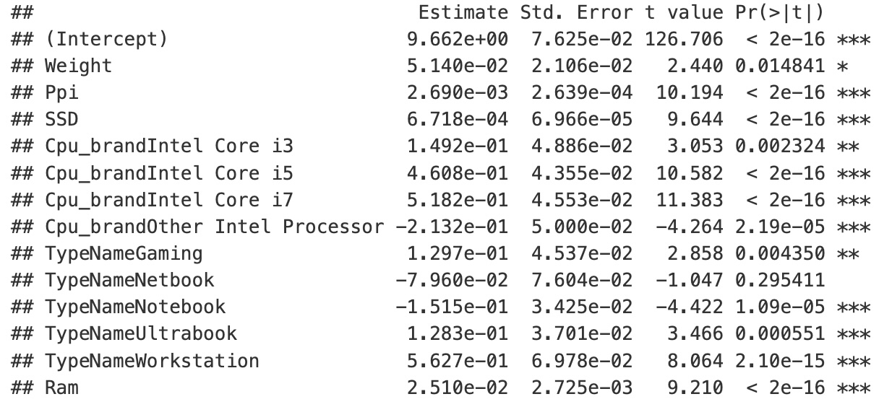
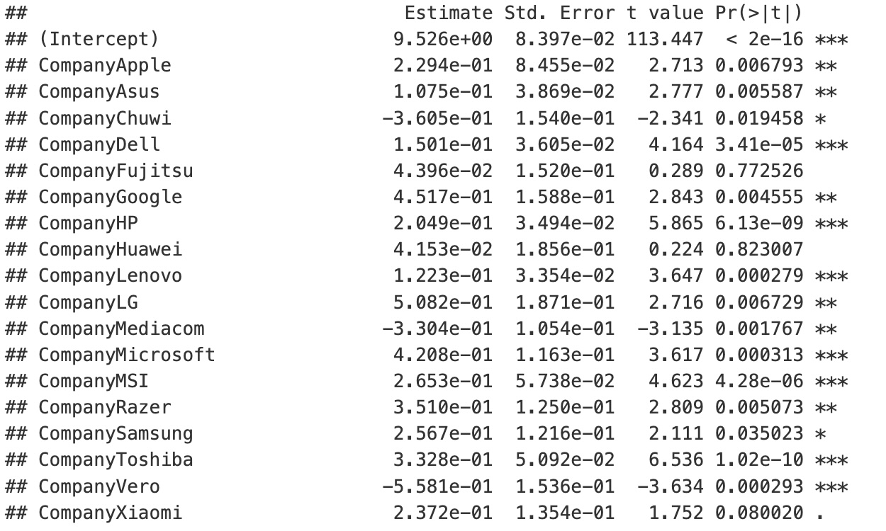

```{r install-package, include = FALSE, eval = FALSE}
# Copy and paste the following code into your console to download and install
# the `xaringan` package that contains all of the code which allows you 
# to create presentation slides in Rmarkdown
install.packages('xaringan')
```


```{r load-packages, include = FALSE}
# Add any additional packages you need to this chunk
library(tidyverse)
library(tidymodels)
library(palmerpenguins)
library(knitr)
library(xaringanthemer)
library(gt)
library(kableExtra)
```

```{r setup, include=FALSE}
# For better figure resolution
knitr::opts_chunk$set(fig.retina = 3, dpi = 300, fig.width = 6, fig.asp = 0.618, out.width = "80%")
```

```{r load-data, include=FALSE}
# Load your data here

```

```{r include=FALSE}

#Background image
style_xaringan(
  title_slide_background_image = "img/bcak2.jpeg"
)
```


class: inverse,center, middle
# introduction
## Analyse the brand, hardware and other factors, to provide users with a laptop buying guide

---

class: center, middle
## Data Discription
```{R table1, echo = FALSE}
# a boring regression
laptop_data <- read.csv("~/final-project/data/laptop_data_cleaned.csv")
# Remove missing values
laptop_data <- laptop_data %>% drop_na()
# Show tibble
laptop_data %>%
  summary() %>%
  kable(format = "html") %>%
  kable_styling(font_size = 11)
```


---

class:  middle, center

# Model Building
```{R graph, echo = FALSE}
# Price distribution plot
ggplot(laptop_data, aes(x = Price)) +
  geom_histogram(fill = "blue", bins = 30, color = "black") +
  labs(title = "Price Distribution", x = "Price", y = "Frequency")
```
---

class:  middle, center 

# Model Building
## p-value > 0.05
Some Companies, Touchscreen, TypeName, Cpu_brand, HDD
## p-value < 0.05
Ram (RAM size), Weight (weight), Ppi (pixel density), SSD (solid-state drive size)
```{R table2, echo = FALSE}
# Split into training and testing datasets
set.seed(123)
train_index <- sample(1:nrow(laptop_data), 0.8 * nrow(laptop_data))
train_data <- laptop_data[train_index, ]
test_data <- laptop_data[-train_index, ]

# Train improved linear regression model
linear_model <- lm(
  Price ~ Weight + Ppi + SSD + Cpu_brand + TypeName + Ram,
  data = train_data
)
linear_model_2 <- lm(Price ~ ., data = train_data)

# Predict on test data
y_pred <- predict(linear_model, newdata = test_data)
```

---

# Model Building
```{r boring-regression,echo=FALSE}
ggplot(data.frame(Actual = test_data$Price, Predicted = y_pred), aes(x = Actual, y = Predicted)) +
  geom_point(color = "blue", alpha = 0.6) +
  geom_abline(intercept = 0, slope = 1, color = "red", linetype = "dashed") +
  labs(title = "Actual vs Predicted (Linear Model)", x = "Actual Price", y = "Predicted Price")
```

---

# Model checking
```{r plot-iris, echo = FALSE}
par(mfrow = c(2, 2))  
plot(linear_model)
```

---

# Data interpretation
```{r graph3, echo=FALSE,out.width = "80%"}

```


---
# Data interpretation
```{r graph4, echo=FALSE,out.width = "80%"}

```
---
class:  middle, center
# Thank you!
```{r graph5, echo=FALSE,out.width = "80%"}

```